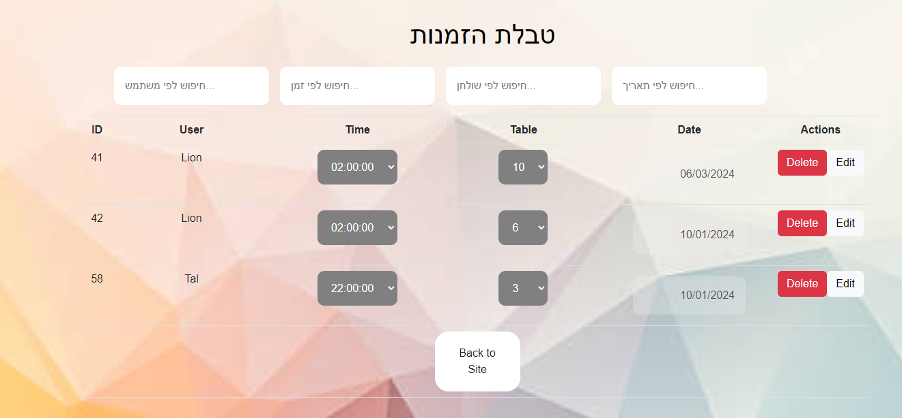
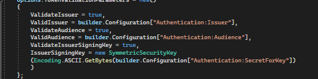
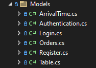
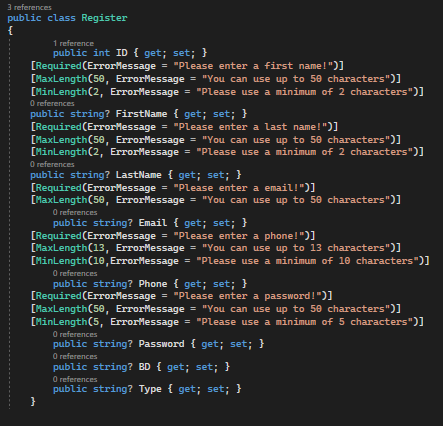
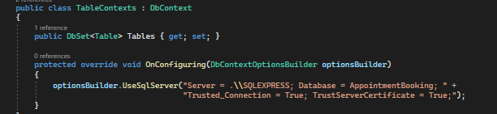
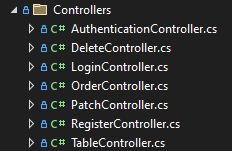
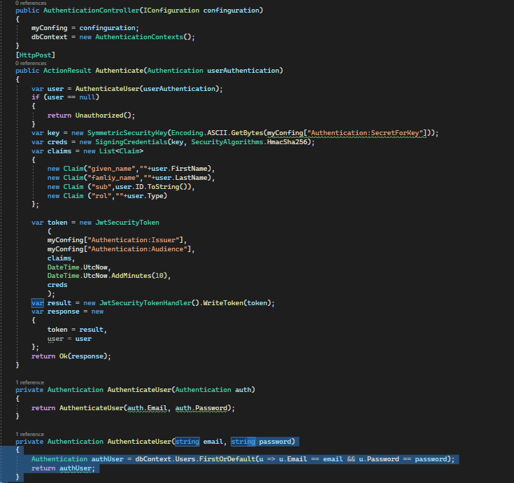
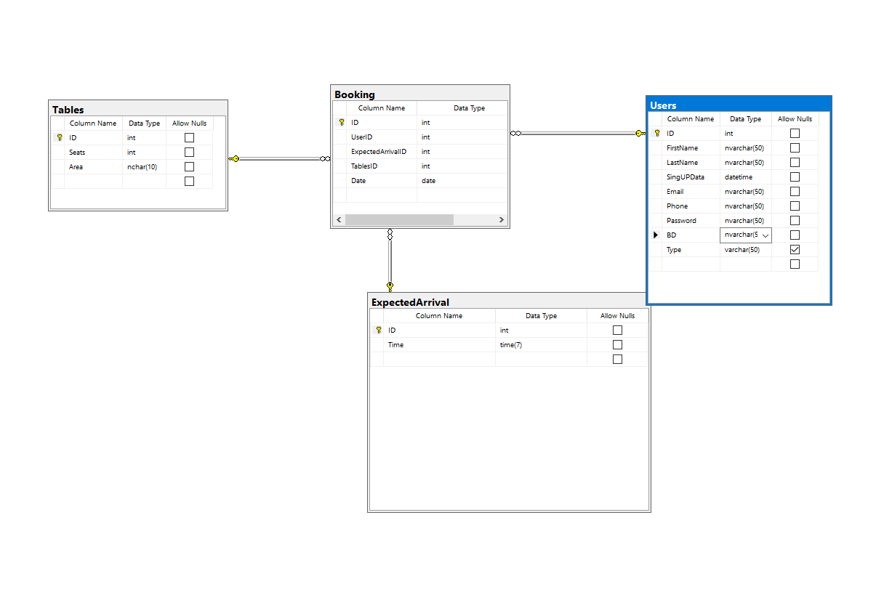
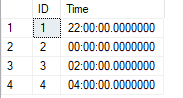
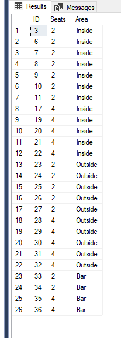

# מגיש
 专
מספר כיתה:D110422ER
טלפון לשאלות: 0546663482 
EMAIL : lion.zolotarov@gmail.com

 בגדול בניתי אתר שקצת שונה מכל השאר אני מאמין בניתי אתר לבר קוקטלים
 שדרכו אפשר להירשם ואז לבצע הזמנה של מקום בהתאם למקום שנשאר ביחס
לאיפה שהוזמן
פתחתי משתמש אחד שיש לו גישות של ADMIN
שמאפשר לו לראות את כלל ההזמנות שבוצעו לעשות סינון וכמובן למחוק הזמנות לפי הצורך
ועכשיו נתחיל עם ההסבר על הקוד 

# צד לקוח
## Assets
 תקייה ששמרתי שם את התמונות שאני משתמש בהם בצד לקוח 

## Componets 
 התקייה עוזרת לנו בחלקים מדף הבית כמו נראות,Navbar וכו' 

### Nabar
פה אנחנו כבר מתחיל לכתוב את JS 
 אנחנו משתמשים גם בCONTEXT ו STATE
שתורם לנו לבדוק אם המשתמש כבר נכנס למערכת או לא ואם כן מה סוג הגישות שקימות אצלו ובהתאם להעביר לפתוח לו חלון לעבור לשם אם הוא חסר 
TYPE אז לאופציה של הזמנה  
  ואם הוא ADMIN
 אז לאופציה לגישות של האדמין 

בתמונה הבא מתבצעת בידקה של הUSER 
המחובר ובהתאתם מופיע האפשרויות של אותו משתמש ה Navbar 
מופיע רק במסך הבית
 
 ואלה התצאות: אם הוא לא מחובר

USER רגיל מחובר

ADMIN מחובר

## Constants
התקייה יוצרת לנו קישור לתמונות למחירים של הקוקטלים בדף הבית

## Pages 
 שומר לנו על הדפים של האתר באופן מסודר
 

 ### HOME
 דף הבית פותח מכמה מכלים זאת אומרת הוא בנוי בחלקים
 

  כל חלק אחראי על משהו אחר
 ABOUTUS 
 
 FINDUS
 
 FOOTER
 
 GALLERY
 
 HEADER
 
 MENU
 פה זה החלק השאני משתמש בו בConstants 
 ולוקח את שמות המוצרים,מרכיבים ומחיר 
 

 ### LoginRegister
 פה אני מתחבר או נרשם למערכת
 

 #### LOGIN
 
 פה מתבצע החיבור הראשוני לAPI 
 לאחר שיש משתמש המשתמש יצטרך להזין פרטים של EMAIL PASSWORD
  ואם המשתמש תקין זה יעביר אותו בהתאם לסוג תוקן שיש לו כלומר אם הוא ADMIN
  זה יעביר אותו לORDERS
 ששם הוא רואה את כלל ההזמנות ויכול למחוק הזמנות וכמובן לעשות סינון
  אם המשתמש NULL 
 זאת אומרת לא אדמין אז ישלח אותו לBOOKTABLE 
 ששם הוא יכול להזמין מקום בהתאם למקומות שנשארו 
   אם אין משתמש ללקוח אז יש לו אופציה לגשת לREGSTER
  וגם אופציה לחזור למשחק הבית

 ביצוע הניתוב לאחר סוג הTOKEN
 

#### REGISTER

פה מתבצע החיבור לAPI סוג POST 
 כדי להירשם לאתר יש פה כמה בלדיציות כמו עם האיימל וטלפון והתאמה כל אחד מהם   

 כמובן שאם למשתמש יש משתמש יש לו כפתור חזרה לLOGIN
 או לדף הבית
לאחר ההרשמה הלקוח מקבל הודעה באתר

### BookTable
 כאן שומרים מקום לבר

 בחלק הזה מתבצע כמה חיבורים שונים לAPI 
  ולכמה טבלאות שונות
 
 לפי זה מופיעות לנו קטגוריות לכלל המקומות כגון Inside,Outside,Bar כמות אנשים ובחירת תאריך ושעה לפי שעות קבועות שהמקום מקבל הזמנות מראש
 לאחר מכן כל בחירה שנעשת המערכת עושה בדיקה שאכן קימים שולחנות לאותו יום והשעה שנבחרו
 
 בתמונה הזאת נשארו לנו 5 מקומות לזמן,לאזור,לכמות אנשים והתאריך הנבחר 
 לאחר הזמנת המקום הלוקח מקבל הודעה ואופציה לחזור לדף הבית 

 ### Admin
   כאן זה גישות של האדמין  
 
 בדף הבא נוצר קישור בין כלל הטבלאות שקימות במערכת נקח את השם הפרטי את זמן את מספר השולחן והתאריך
  לטבלה מראה לנו איזה הזמנות בוצע על ידי מי וכו' 
 מתצע חיבור של 4 הטבלות עם הפרטים שצריכים
 
  לאדמין יש גם את הגישה לבטל את ההזמנה וללחוץ DELETE
 
 בדף יש גם סינון לפי הפרמטרים שמקבלים שכך אפשר למצוא הזמנות ספציפיות במערכת
  אדם שאין לו TYPE ADMIN 
וינסה להתחבר דרך URL /admin
יקבל מסך לבן רק בלי אופציה לכלום 

## Context 
פה נוצר הזיכרון של הTOKEN 
דרך הPROVIDER
בשביל שלא יעלם וישמר במערכת כל עוד אני משתמש בו ברגע שאני עושה LOGOUT
הTOKEN והUSER = NULL

## App 

פה נוצרים הדפים
תחת BrowserRouter Routes Route
 וכמובן של  הPROVIDER 
עוטף אותם כדי שהמשתמש ישאר במערכת
专 
נוסף גם שאם הלקוח/האדמין ינסו להגיע לנתיב שלא קיים יקבלו דף שמופיע בו Not Found 404

# צד שרת
## Program
פה כנסתי כמה דברים
   אחד מהם זה את Authentication ראשוני
שלוקח Issuer ,SecretForKey ,Audience

Policy הכנסתי פה גם  
של ADMIN 

## Models

   לכל אחד מהם יש את הפרמטרים שאני מקבל ומביא בהתאם למה שאני צריך ובהתאם לטבלה 
בחלק מMODELS 
 אני יוצר דרישות והערות בהתאם לדרישות למשתמש 
 驻 

## Contexts

  לכל אחד מהMODELS יש CONTEXT משלו
שיוצר לו חיבור לDATA 
:

## Controllers

חלק מהקונטרולרים נבנו לשימוש עתידי ומחשבה קדימה
הCONTROLLER הכי חשוב הואAuthentication

שיוצר לנו את הTOKEN כולו 
זאת אומרת אני מכניס את הEMAIL & PASSWORD
ומקבל טוקן שלוקח כמה פרמטרים של המשתמש ועוד כמה פרמטרים קימיים ויוצר לנו את הTOKEN

בCONTROLLERS יש לנו  
GET
POST
DELETE 
ואופציה לPATCH בעתיד

## SQL

יש 4 טבלאות 
USERS
EXPECTEDARRIVAL
TABLES
שמעברים  ID ל 
BOOKING
ששומר את פירטי ההזמנה של הלקוחות
לEXPECTEDARRIVAL אין PUST רק GET 
  כי הזמנים קבועים ולא נתנים לשנות 

 TABLES 
 לכל שולחן יש את המספר שלו כמות אנשים והאזור שהוא נמצא לכן גם פה נמשוך רק נתונים ולא נשנה

😂מקווה שאהבתם את בפרויקט שלי שנכתב בהרבה חוסר שינה ועצבים😂
לשאלות מוזמנים לפנות אלי  